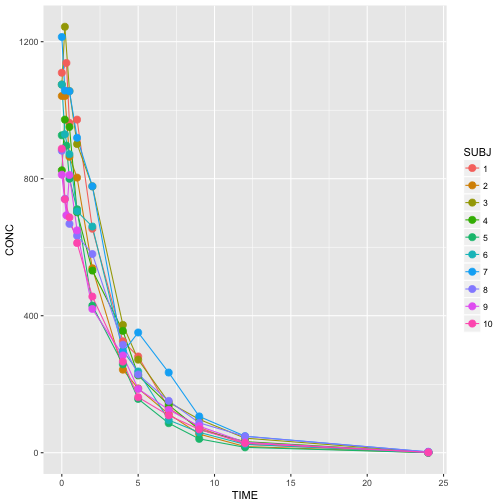

# Oral Dosing Simulation


```r
# simOral1comp ----

pk1coma = function(CL, V, Ka, BioA=1, DosingHistory, Time, PropE=0, AddE=0, LLoQ=0, Jitter=0)
{
  nObs = length(Time)
  Conc = rep(0, nObs)
  ke = CL/V

  if (Jitter > 0) Time = round(jitter(Time), Jitter)
  Time[Time < 0] = 0

  TERM1 = BioA*Ka/(Ka - ke)/V
  DH = DosingHistory[DosingHistory[,2] > 0,,drop=FALSE]
  nAmt = nrow(DH)
  for (i in 1:nAmt) {
    TERM2 = DH[i, 2]*TERM1
    dTime = Time - DH[i, 1]
    dTime2 = dTime[dTime >= 0]
    Conc = Conc + c(rep(0, length(dTime) - length(dTime2)), TERM2*(exp(-ke*dTime2) - exp(-Ka*dTime2)))
  }

  Err1 = rnorm(nObs, mean=0, sd=PropE)
  Err2 = rnorm(nObs, mean=0, sd=AddE)

  Conc = Conc + Conc*Err1 + Err2
  Conc[Conc < LLoQ] = 0
  return(cbind(Time, Conc))
}


CL = 20
V = 100
Ka = 2
Time = c(0, 0.25, 0.5, 1, 2, 4, 5, 7, 9, 12, 24)

DH1 = matrix(c(0, 100000), nrow=1, ncol=2, byrow=TRUE)

x1 = pk1coma(CL, V, Ka, BioA=1, DH1, Time, PropE=0.1, AddE=1, LLoQ=0, Jitter=2)
# windows()
plot(x1[,"Time"], x1[,"Conc"], type="o")
```



```r
library(ncar)
sNCA(x1[,"Time"], x1[,"Conc"], dose=100000)
```

```
##            b0          CMAX         CMAXD          TMAX          TLAG 
##  6.867775e+00  7.681966e+02  7.681966e-03  1.020000e+00  0.000000e+00 
##          CLST         CLSTP          TLST        LAMZHL          LAMZ 
##  8.701036e+00  8.756325e+00  2.396000e+01  3.535081e+00  1.960767e-01 
##        LAMZLL        LAMZUL       LAMZNPT        CORRXY            R2 
##  4.950000e+00  2.396000e+01  5.000000e+00 -9.994759e-01  9.989521e-01 
##         R2ADJ            C0        AUCLST        AUCALL        AUCIFO 
##  9.986028e-01            NA  4.813957e+03  4.813957e+03  4.858333e+03 
##       AUCIFOD        AUCIFP       AUCIFPD        AUCPEO        AUCPEP 
##  4.858333e-02  4.858615e+03  4.858615e-02  9.133928e-01  9.191434e-01 
##       AUCPBEO       AUCPBEP       AUMCLST       AUMCIFO       AUMCIFP 
##            NA            NA  2.509286e+04  2.638242e+04  2.639062e+04 
##       AUMCPEO       AUMCPEP      MRTIVLST      MRTIVIFO      MRTIVIFP 
##  4.887946e+00  4.917479e+00            NA            NA            NA 
##      MRTEVLST      MRTEVIFO      MRTEVIFP           VZO           VZP 
##  5.212523e+00  5.430345e+00  5.431716e+00            NA            NA 
##          VZFO          VZFP           CLO           CLP          CLFO 
##  1.049752e+05  1.049691e+05            NA            NA  2.058319e+04 
##          CLFP          VSSO          VSSP 
##  2.058200e+04            NA            NA 
## attr(,"units")
##  [1] ""          "ug/L"      "ug/L/mg"   "h"         "h"        
##  [6] "ug/L"      "ug/L"      "h"         "h"         "/h"       
## [11] "h"         "h"         ""          ""          ""         
## [16] ""          "ug/L"      "h*ug/L"    "h*ug/L"    "h*ug/L"   
## [21] "h*ug/L/mg" "h*ug/L"    "h*ug/L/mg" "%"         "%"        
## [26] "%"         "%"         "h2*ug/L"   "h2*ug/L"   "h2*ug/L"  
## [31] "%"         "%"         "h"         "h"         "h"        
## [36] "h"         "h"         "h"         "L"         "L"        
## [41] "L"         "L"         "L/h"       "L/h"       "L/h"      
## [46] "L/h"       "L"         "L"
```

